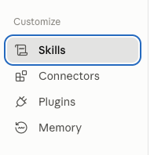
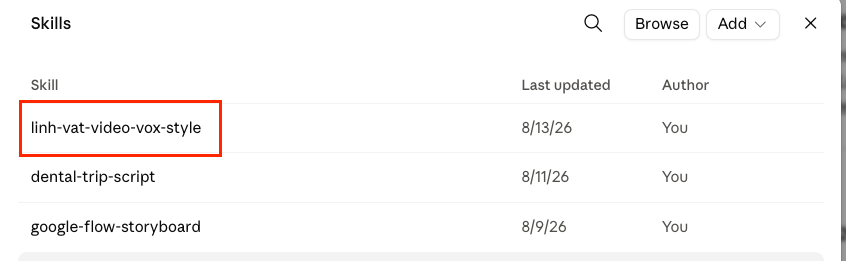
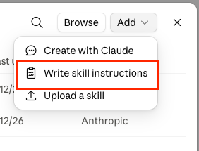
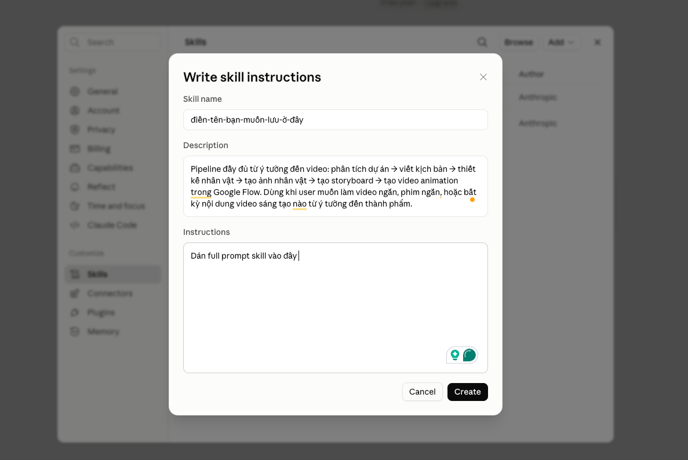
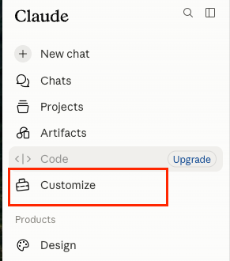
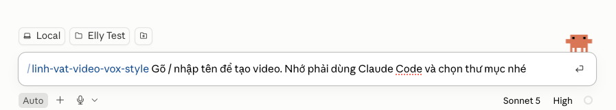
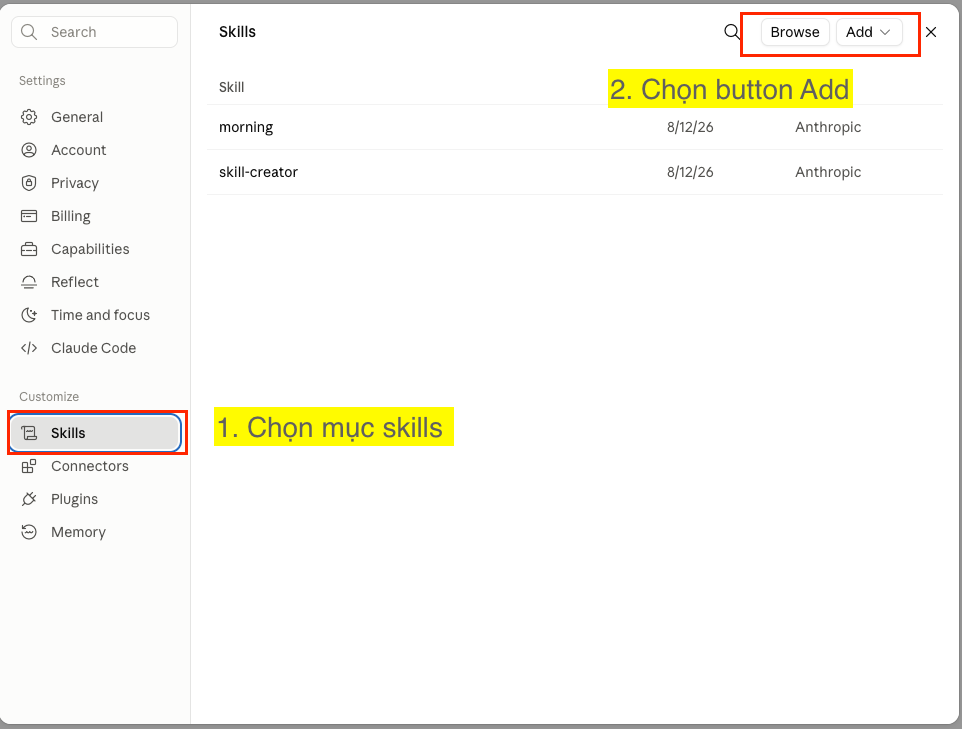

# Hướng dẫn dùng Skill

Bản gốc của skill này được chia sẻ dưới dạng file .docx kèm hướng dẫn cài lên tài
khoản Claude. Nội dung hướng dẫn được giữ lại ở đây cho đầy đủ.

> **Lưu ý:** trong repo này skill đã được cài sẵn ở
> `.claude/skills/linh-vat-video-vox-style/`, nên khi làm việc trong project này bạn
> **không cần** làm lại các bước dưới. Các bước dưới chỉ cần khi bạn muốn cài skill này
> thành skill cá nhân trên tài khoản Claude (dùng được ở mọi project).

## Chuẩn bị

- Đảm bảo tài khoản Claude dùng bản trả phí để sử dụng mô hình Claude Code.
- Đảm bảo thiết lập Claude tự do truy cập trên Google Chrome để Claude có thể tự
  google tìm ảnh trên các source miễn phí.
  Chi tiết cách làm tham khảo tại 2:45 video
  <https://www.youtube.com/watch?v=mCnR9j-Qk9Y&t=5s>
- Đảm bảo thiết lập xong Remotion trên Claude — chi tiết cách làm xem tại video
  <https://www.youtube.com/watch?v=qkdd0D-dljc&t=5s>

## Các bước cài skill lên tài khoản Claude

**Bước 1:** Vào Claude → chọn mục **Customize**

**Bước 2:** Chọn mục **Skills**

**Bước 3:** Chọn button **Add**

**Bước 4:** Chọn mục **"Write skill instructions"**

**Bước 5:** Nhập thông tin full — lấy tên skill, mô tả và nội dung chi tiết từ
`../SKILL.md`

**Bước 6:** Bạn đã tạo xong rồi

**Bước 7:** Test thôiii — gõ `/` rồi ghi tên skill ra để dùng nha.
Luôn chọn Claude Code để tạo và nhớ chọn thư mục để Claude làm việc nhé.

## Lưu ý — Claim

- Bản prompt này là bản dùng trong video YouTube hướng dẫn, hiện tại đang đúng theo
  con máy Claude của tác giả. Không tránh khỏi rủi ro khi cài lên bản của các bạn thì
  sẽ bị lệch đôi chút. Để chỉnh sửa, các bạn cứ trao đổi với Claude để nó hiểu mong
  muốn của mình và yêu cầu nó update lại.
- Vì prompt cố định 1 dạng style nên 10 người dùng sẽ ra cùng 1 kiểu video. Bạn muốn
  đổi style theo ý mình thì cứ cài prompt như bình thường, sau đó trao đổi lại với
  Claude theo ý mình và pack lại thành skill cá nhân.
- Hãy đọc kỹ prompt trước khi đưa vào sử dụng, nếu có phần nào muốn sửa đổi, hãy tự do
  sửa đổi nhé.

## Khác biệt so với bản gốc

Bản gốc viết cho một Remotion project dùng JSX và đăng ký `<Composition>` trực tiếp
trong `src/Root.jsx`. Repo này dùng **TypeScript** và khai báo composition trong
`src/Composition.tsx` (được `src/Root.tsx` render), nên `SKILL.md` ở đây đã được chỉnh
theo đúng convention của repo, và `references/example-scene.tsx` là bản `.tsx` (đã
type-check và render thử bằng Remotion).
